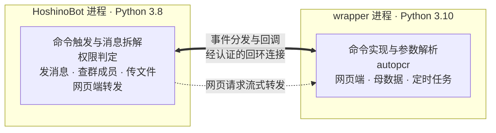

# autopcr_hoshino

让 autopcr 以 HoshinoBot 插件的形式运行，而无需两者共用同一个 Python 环境。

## 解决的问题

autopcr 与 HoshinoBot 对同一批依赖提出了互不相容的版本要求，无法安装在同一环境中：

| 依赖 | HoshinoBot | autopcr |
|---|---|---|
| Quart | `==0.14.1` | `~=0.19.1` |
| Jinja2 | `~=2.11.2` | `~=3.1.3` |
| MarkupSafe | `~=1.0` | `~=2.1.5` |
| Pillow | `~=9.1.0` | `~=9.5.0` |
| Python | 3.8 | `>=3.10,<3.11` |

四对约束均无公共解，可用 `scripts/verify_conflict.sh` 复核。autopcr 的网页端依赖 `quart-auth`、`quart-rate-limiter`、`quart-compress`，这三者都要求 Quart 0.19 的接口，因此把 autopcr 的蓝图注册到 HoshinoBot 的 Quart 0.14 应用上并不可行。

本项目把 autopcr 移入独立解释器运行的子进程，在 HoshinoBot 一侧只保留消息收发与权限判定。用户可见的行为不变：命令、参数、输出图片以及网页端的访问地址都与原先一致。

## 架构



autopcr 与命令实现同在 wrapper 进程内，彼此为直接调用，不经过进程边界。

两个进程通过回环地址上的 TCP 连接通信。兼容层监听由系统分配的端口，wrapper 启动后反向连接，端口与共享密钥经环境变量传递。连接建立时双方各自发出随机挑战并以 HMAC-SHA256 应答，一个往返完成相互认证。

链路上同时存在两个方向的调用：兼容层把消息事件送往 wrapper，wrapper 请求兼容层发送消息、查询群成员、上传文件。消息按请求编号多路复用，因此多条命令可以并发处理，一条耗时较长的命令不会阻塞其他命令。

消息内容与权限判定在事件产生时一次求出并随事件下发，wrapper 读取这些内容不产生往返。发送消息不等待回执，与宿主框架自身的行为一致。

网页端由 wrapper 进程提供服务，兼容层在 `/daily` 路径下把请求原样转发过去，因此访问地址仍是宿主框架的地址。转发以流式进行，服务端推送的验证码事件能够即时到达浏览器。

## 部署

### 1. 准备 autopcr 运行环境

autopcr 的源码需单独存放，不放在 HoshinoBot 的模块目录内。

```bash
uv venv --python 3.10 .venv-autopcr
uv pip install --python .venv-autopcr/bin/python -r <autopcr 目录>/requirements.txt
```

网页端的前端资源不随源码分发，需在 autopcr 目录下执行一次 `python _download_web.py` 取得。缺少该资源时接口仍可用，页面会返回 404。

### 2. 放置本项目

把本目录放入 HoshinoBot 的 `hoshino/modules/`，并在 `hoshino/config/__bot__.py` 的 `MODULES_ON` 中加入 `autopcr_hoshino`。

### 3. 配置

至少需要指定 autopcr 源码位置：

```bash
export AUTOPCR_HOSHINO_AUTOPCR_ROOT=/path/to/autopcr
```

| 环境变量 | 默认值 | 说明 |
|---|---|---|
| `AUTOPCR_HOSHINO_AUTOPCR_ROOT` | 空 | autopcr 源码根目录，即包含 `autopcr` 包的那一层 |
| `AUTOPCR_HOSHINO_PYTHON` | `<项目>/.venv-autopcr/bin/python` | 运行 wrapper 的解释器 |
| `AUTOPCR_HOSHINO_WEB_PROXY` | `true` | 是否在宿主框架上提供网页端转发 |
| `AUTOPCR_HOSHINO_WEB_PREFIX` | `/daily` | 网页端路径前缀 |
| `AUTOPCR_HOSHINO_WEB_PORT` | `0` | wrapper 网页端端口，`0` 表示由系统分配 |
| `AUTOPCR_HOSHINO_RESTART_DELAY` | `5` | wrapper 退出后的重启间隔秒数，连续失败时逐次加倍 |
| `AUTOPCR_HOSHINO_MAX_RESTART_DELAY` | `300` | 重启间隔的上限秒数 |
| `AUTOPCR_HOSHINO_STARTUP_TIMEOUT` | `180` | 等待 wrapper 就绪的秒数 |
| `AUTOPCR_PUBLIC_ADDRESS` | 自动探测 | 网页端对外地址，用于生成配置与验证码链接 |
| `AUTOPCR_USE_HTTPS` | `false` | 对外地址是否使用 HTTPS |

autopcr 自身的环境变量原样透传给 wrapper 进程。

## 命令

命令集与原先一致，发送 `#帮助` 可查看完整说明。工具类命令的形态为：

```
#[导出][群]<工具名> [昵称] [参数...]
```

`导出` 使结果以表格文件上传到群，`群` 使操作对象为本群共用账号。昵称可省略，省略时使用默认账号；`所有` 表示该号码下的全部账号，`批量` 表示网页端已勾选的账号。

## 与同进程部署的差异

网页端的注册接口不再校验注册者是否在机器人所在的群内。该校验原先依赖从 autopcr 反向导入宿主插件中的函数，跨进程后该导入路径不存在。如需限制注册，请通过 autopcr 的 `AUTOPCR_SERVER_ALLOW_REGISTER` 关闭公开注册。

## 开发与验证

```bash
make venv-autopcr    # 创建运行 autopcr 的环境
make venv-hoshino    # 创建模拟宿主框架的环境，仅验证需要
make check           # 静态检查、双环境语法检查、全部实测
make test-autopcr    # 拉起真实的 autopcr 验证网页端与转发
```

实测各自覆盖一个方面：

- `tests/session_check.py` 验证会话在命令返回后仍可用、保留期结束后被回收、以及容量上限生效。
- `tests/cross_env_check.py` 由 Python 3.8 拉起真实的 wrapper 子进程，验证认证、请求响应、兆字节消息、事件分发、并发处理、密钥拒绝与崩溃重启。
- `tests/proxy_check.py` 在 Quart 0.14 上验证转发，重点是事件流边收边发而非整体缓冲。
- `tests/hoshino_load_check.py` 在临时目录中搭建最小的 HoshinoBot 部署，验证模块加载、服务注册、命令触发器与前缀匹配优先级。
- `tests/orphan_check.py` 强制终止宿主进程，验证 wrapper 随之退出而非成为孤儿进程。
- `tests/autopcr_boot_check.py` 启动真实的 autopcr，验证网页端可用、端口上报以及经转发端点的访问。该项需要 autopcr 源码，其余各项不需要。

实测均不改动参考仓库，临时文件写入系统临时目录。
