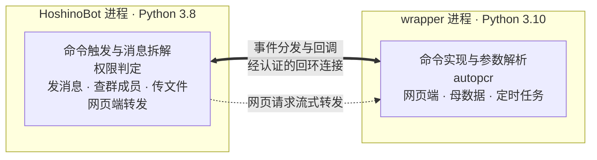

# autopcr_hoshino

让 autopcr 以 HoshinoBot 插件的形式运行，而无需两者共用同一个 Python 环境。

## 解决的问题

autopcr 与 HoshinoBot 对同一批依赖提出了互不相容的版本要求，无法安装在同一环境中：

| 依赖 | HoshinoBot | autopcr |
|---|---|---|
| Quart | `==0.14.1` | `~=0.19.1` |
| Jinja2 | `~=2.11.2` | `~=3.1.3` |
| MarkupSafe | `~=1.0` | `~=2.1.5` |
| Pillow | `~=9.1.0` | `~=9.5.0` |
| Python | 3.8 | `>=3.10,<3.11` |

四对约束均无公共解，可用 `scripts/verify_conflict.sh` 复核。autopcr 的网页端依赖 `quart-auth`、`quart-rate-limiter`、`quart-compress`，这三者都要求 Quart 0.19 的接口，因此把 autopcr 的蓝图注册到 HoshinoBot 的 Quart 0.14 应用上并不可行。

本项目把 autopcr 移入独立解释器运行的子进程，在 HoshinoBot 一侧只保留消息收发与权限判定。用户可见的行为不变：命令、参数、输出图片以及网页端的访问地址都与原先一致。

## 架构



autopcr 与命令实现同在 wrapper 进程内，彼此为直接调用，不经过进程边界。

两个进程通过回环地址上的 TCP 连接通信。兼容层监听由系统分配的端口，wrapper 启动后反向连接，端口与共享密钥经环境变量传递。连接建立时双方各自发出随机挑战并以 HMAC-SHA256 应答，一个往返完成相互认证。

链路上同时存在两个方向的调用：兼容层把消息事件送往 wrapper，wrapper 请求兼容层发送消息、查询群成员、上传文件。消息按请求编号多路复用，因此多条命令可以并发处理，一条耗时较长的命令不会阻塞其他命令。

消息内容与权限判定在事件产生时一次求出并随事件下发，wrapper 读取这些内容不产生往返。发送消息不等待回执，与宿主框架自身的行为一致。

网页端由 wrapper 进程提供服务，兼容层在 `/daily` 路径下把请求原样转发过去，因此访问地址仍是宿主框架的地址。转发以流式进行，服务端推送的验证码事件能够即时到达浏览器。

## 部署

把本目录放入 HoshinoBot 的 `hoshino/modules/`，在 `hoshino/config/__bot__.py` 的 `MODULES_ON` 中加入 `autopcr_hoshino`，启动机器人即可。

首次启动时会自动取得 autopcr 源码、创建运行环境、安装依赖并下载网页端前端资源。该过程在后台进行，不阻塞机器人启动，期间收到的命令会提示服务尚未就绪。准备进度与失败原因均记录在日志中。

自动准备需要 `git`，以及 `uv` 或一个 Python 3.10 解释器之一。日志会在启动时列出这些程序的可用状况。

### 自行管理环境

设置 `AUTOPCR_ROOT` 即视为自行管理，此时不会自动取得源码或改动环境：

```bash
uv venv --python 3.10 .venv-autopcr
uv pip install --python .venv-autopcr/bin/python -r <autopcr 目录>/requirements.txt
```

```python
# hoshino/config/autopcr_hoshino.py
AUTOPCR_ROOT = "/path/to/autopcr"
PYTHON = ".venv-autopcr/bin/python"
```

网页端的前端资源不随源码分发，需在 autopcr 目录下执行一次 `python _download_web.py` 取得。缺少该资源时接口仍可用，页面会返回 404。

### 数据位置

账号配置、母数据与运行结果位于 autopcr 源码目录下的 `cache` 与 `result`，自动准备时即 `<项目>/.autopcr/`。备份账号时取 `cache` 目录。

源码更新只做快进式合并，且在检测到本地改动时跳过，不会触碰上述目录。

### 配置

配置写在宿主框架的配置目录中，与其他插件一致。把仓库内的 `_config_example.py` 复制为 `hoshino/config/autopcr_hoshino.py` 后按需修改，全部项均可省略：

```python
# hoshino/config/autopcr_hoshino.py
AUTOPCR_ROOT = "/srv/autopcr"
AUTO_UPDATE = True
```

| 配置项 | 默认值 | 说明 |
|---|---|---|
| `AUTO_PROVISION` | `True` | 未设置 `AUTOPCR_ROOT` 时是否自动准备 |
| `AUTOPCR_REPO` | `https://github.com/cc004/autopcr` | 自动准备时使用的仓库 |
| `AUTOPCR_REF` | 空 | 检出的分支或标签，留空则用远端默认分支 |
| `AUTO_UPDATE` | `False` | 每次启动是否尝试更新源码 |
| `MANAGED_ROOT` | `.autopcr` | 自动准备时源码与数据的位置 |
| `MANAGED_VENV` | `.venv-autopcr` | 自动准备时运行环境的位置 |
| `AUTOPCR_PYTHON_VERSION` | `3.10` | 自动准备运行环境时使用的 Python 版本 |
| `AUTOPCR_ROOT` | 空 | 自行管理时的 autopcr 源码根目录 |
| `PYTHON` | `.venv-autopcr/bin/python` | 自行管理时运行 wrapper 的解释器 |
| `VERIFY_REGISTER` | `True` | 网页端注册是否要求号码在机器人所在的群内 |
| `WEB_PROXY` | `True` | 是否在宿主框架上提供网页端转发 |
| `WEB_PREFIX` | `/daily` | 网页端路径前缀 |
| `WEB_HOST` | `127.0.0.1` | wrapper 网页端监听地址 |
| `WEB_PORT` | `0` | wrapper 网页端端口，`0` 表示由系统分配 |
| `RESTART_DELAY` | `5` | wrapper 退出后的重启间隔秒数，连续失败时逐次加倍 |
| `MAX_RESTART_DELAY` | `300` | 重启间隔的上限秒数 |
| `HEALTHY_UPTIME` | `60` | 运行超过该秒数即视为正常，重启间隔随之重置 |
| `STARTUP_TIMEOUT` | `180` | 等待 wrapper 就绪的秒数 |
| `AUTOPCR_PUBLIC_ADDRESS` | 自动探测 | 网页端对外地址，用于生成配置页与验证码链接 |
| `AUTOPCR_USE_HTTPS` | `False` | 对外地址是否使用 HTTPS |

配置模块不存在时使用默认值，与宿主框架对缺失配置的处理一致。配置项写成空字符串等同于未设置，回落到默认值。

**环境变量优先于配置模块**，便于在容器部署中临时覆盖，也是把配置传入 wrapper 进程的途径。变量名为配置项加 `AUTOPCR_HOSHINO_` 前缀，例如 `AUTOPCR_ROOT` 对应 `AUTOPCR_HOSHINO_AUTOPCR_ROOT`；`AUTOPCR_PUBLIC_ADDRESS` 与 `AUTOPCR_USE_HTTPS` 沿用 autopcr 自身的变量名，不加前缀。autopcr 自身的其他环境变量原样透传给 wrapper 进程。

## 命令

命令集与原先一致，发送 `#帮助` 可查看完整说明。工具类命令的形态为：

```
#[导出][群]<工具名> [昵称] [参数...]
```

`导出` 使结果以表格文件上传到群，`群` 使操作对象为本群共用账号。昵称可省略，省略时使用默认账号；`所有` 表示该号码下的全部账号，`批量` 表示网页端已勾选的账号。

## 开发与验证

```bash
make venv-autopcr    # 创建运行 autopcr 的环境
make venv-hoshino    # 创建模拟宿主框架的环境，仅验证需要
make check           # 静态检查、双环境语法检查、全部实测
make test-autopcr    # 拉起真实的 autopcr 验证网页端与转发
make test-provision  # 从零取得源码、建环境并拉起 wrapper
```

实测各自覆盖一个方面：

- `tests/settings_check.py` 验证配置模块与环境变量的取值、优先级、大小写宽容，以及配置缺失时的行为。
- `tests/session_check.py` 验证会话在命令返回后仍可用、保留期结束后被回收、以及容量上限生效。
- `tests/cross_env_check.py` 由 Python 3.8 拉起真实的 wrapper 子进程，验证认证、请求响应、兆字节消息、事件分发、并发处理、密钥拒绝与崩溃重启。
- `tests/proxy_check.py` 在 Quart 0.14 上验证转发，重点是事件流边收边发而非整体缓冲。
- `tests/hoshino_load_check.py` 在临时目录中搭建最小的 HoshinoBot 部署，验证模块加载、服务注册、命令触发器、前缀匹配优先级，以及配置目录中的配置确实生效。
- `tests/orphan_check.py` 强制终止宿主进程，验证 wrapper 随之退出而非成为孤儿进程。
- `tests/autopcr_boot_check.py` 启动真实的 autopcr，验证网页端可用、端口上报、经转发端点的访问以及注册接口的号码校验。
- `tests/provision_check.py` 从零取得源码、创建环境、安装依赖，并用该环境拉起 wrapper。

`make test` 涵盖的前六项不需要 autopcr；`test-autopcr` 需要现成的 autopcr 源码，`test-provision` 需要 `git` 与可克隆的仓库。实测均不改动参考仓库，产物写入系统临时目录。
